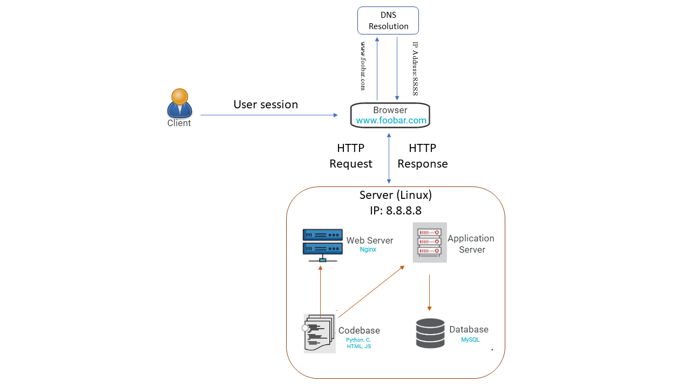

# Simple Web Stack

---

## Description

This is a simple web infrastructure design thay hosts a web page with domain name `www.foobar.com`. This is a simple/basic setup with no SSL certificates or firewall or monitoring. The single server's resources are shared with the web server, application server and database.

## Specifics about this infrastructure

- What is a server?

  A server is a computer hardware or software that manage access to a centralized resource or service in its network. Users accessing these resouces are usually referred to as _clients_.

- What is the role of the domain name?

  The domain name provides a human-friendly and memorable alias for the IP address that links to a resouce on a server. This mapping is done by the Domain Name System (DNS).

- What type of DNS record www is in www.foobar.com?

  The `www` in `www.foobar.com` uses an **A record** and can be checked using the `Dig` tool on a web browser or by running `dig www.foobar.com`. While the web result might be different, this design uses an **A** record.

  _Address Mapping record (A Record) which is also referred to as a DNS host record, stores an hostname and its corresponding IPv4 address._

- What is the role of the web server?

  The web server is a computer software with underlying hardware that accepts requests via HTTP or HTTPS. The web server returns a response with the contents of what was requested for or an error message.

- What is the role of the application server?

  The application server hosts and handles every logic required by the web server or client.

- What is the role of the database?`

  The database stores organized data which is easily accessed, managed and updated. Also displays requested and updated information in the web application.

- What is the server using to communicate with the computer of the user requesting the website?

  Commnuication between the client and the server is happening over the internet via HTTP at the application level of the OSI model over TCP/IP at the transport layer of the OSI model.

## Issues are with this infrastructure

- SPOF (Single Point of Failure)

  Every component of this stack is dependent on each other. Hence once a component is down or unreachable, the web sites will be down and unreachable.

- Downtime when maintenance needed (like deploying new code web server needs to be restarted)

  When maintenance action is required, the site is going to experience downtime because components of the stack requiring maintenance would have to be turned off or taken offline, and as mentioned above, will lead to a Single point of failure(SPOF) and the entire website will be down.

- Cannot scale if too much incoming traffic

  This stack design will be hard to scale simply because the design has every resource/components are on a single server. Hence the server can run out of processing resources or performance becomes degraded when requests and traffic increases drastically.
